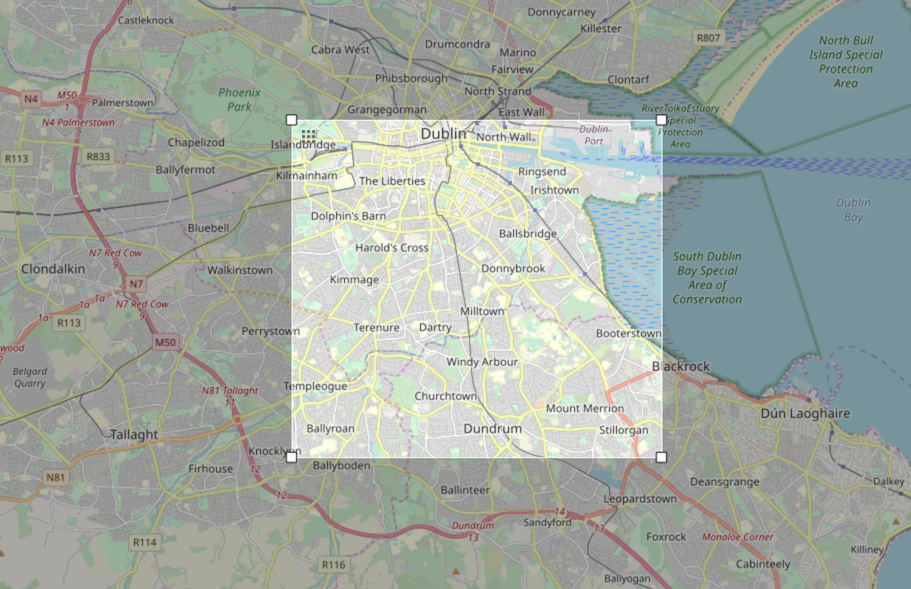

### Dublin OpenStreetMap Project

The Dublin OpenStreetMap project was created as part of the assigments for the course [Data Wrangling with MongoDB](https://classroom.udacity.com/courses/ud032) facilitated over the Data Analyst Nanodegree.

In order to complete the project, student has to select an area over [OpenStreetMap](https://www.openstreetmap.org) and download the dataset to explore and apply techniques such as cleaning and Wrangling of the data.
### Scenario & Dataset

For this project I have selected to explore the city I live in: Dublin, Ireland.

Specifically the area highlighted in the picture below.

### Tools used
- [OpenStreetMap](https://www.openstreetmap.org): Selected the area and coordinates of the map
- [OverPass API](https://overpass-api.de/): Used for downloading the data is OSM format matching the coordinates
- Python: used for Cleaning & DataWrangling, Insert/Delete Operations and query to Sqlite3
- Sqlite3: used as Data Storage
- Jupyter Notebooks: Used to document the project

### Source

- [dublin_openstreet.py](./dublin_openstreet.py): python module that was used for cleaning and wrangling of the data.
- [dublin_db.py](./dublin_db.py): python module that contains DB class definition to allow the following operation in sqlite3:
    - creation of database
    - connection to a database
    - drop tables
    - create tables
    - query execution
- [queries.py](./queries.py): python module that contains all the queries to be executed
- [dublin_queries.py](./dublin_queries.py): Main python module that contains a CLI in order to allow the user to execute all queries or pass a list of queries to execute.
